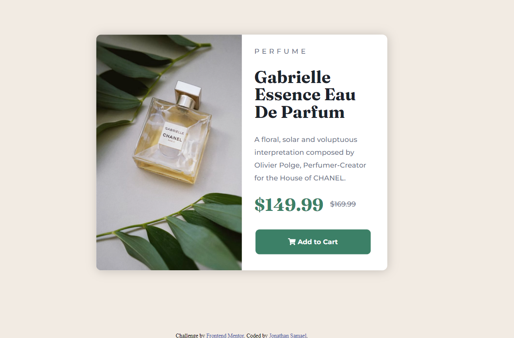

# Frontend Mentor - Product preview card component solution

This is a solution to the [Product preview card component challenge on Frontend Mentor](https://www.frontendmentor.io/challenges/product-preview-card-component-GO7UmttRfa). Frontend Mentor challenges help improve your coding skills by building realistic projects. 

## Table of contents

- [Overview](#overview)
  - [The challenge](#the-challenge)
  - [Screenshot](#screenshot)
  - [Links](#links)
- [My process](#my-process)
  - [Built with](#built-with)
  - [What I learned](#what-i-learned)
  - [Continued development](#continued-development)
- [Author](#author)


## Overview

### The challenge

*_Learn more about responsive design in this project was incredible._*

Users should be able to:

- View the optimal layout depending on their device's screen size
- See hover and focus states for interactive elements

### Screenshot




### Links

- Solution URL: [Add solution URL here](https://your-solution-url.com)
- Live Site URL: [Add live site URL here](https://your-live-site-url.com)

## My process

### Built with

- Semantic HTML5 markup
- CSS custom properties
- Flexbox
- Responsive web design

### What I learned

Work with responsive web design it's the **most difficult** that challenge. But _I managed to learn_ more about it and make worked. 

```css
@media (max-width: 576px) {
    .white-box {
        margin: auto;
        max-width: 576px;
        width: 365px;
        height: 630px;
    }

    main img {
        float: none;
        width: 100%;
        height: 40%;
        border-top-right-radius: 10px;
        border-bottom-left-radius: 0px;
    }
}
```

### Continued development

Now, I'll learn more about _grid_ and the _flex_ property. Improve my skills to biggers challenges.
- Next step is JavaScripts!

## Author

- Instagram - [@jonathan_samael_](https://www.instagram.com/jonathan_samael_/)
- Frontend Mentor - [@JonathanSamael](https://www.frontendmentor.io/profile/JonathanSamael)
- LinkedIn - [@jonathan-amaral](https://www.linkedin.com/in/jonathan-amaral/)
